<!-- ========================= HEADER ========================= -->

  

  

---

## `~/toolkit`

  

## `~/stats`

  
  

  

## `~/contributions`

  

---

## `~/achievements`

  

---

## `~/connect`

  
  
  

---

  

  

